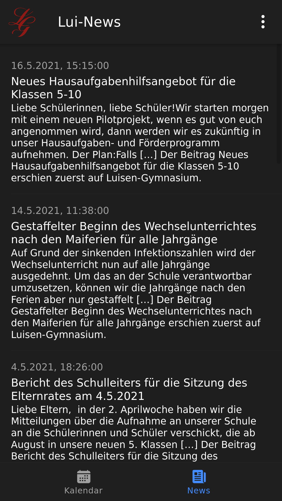
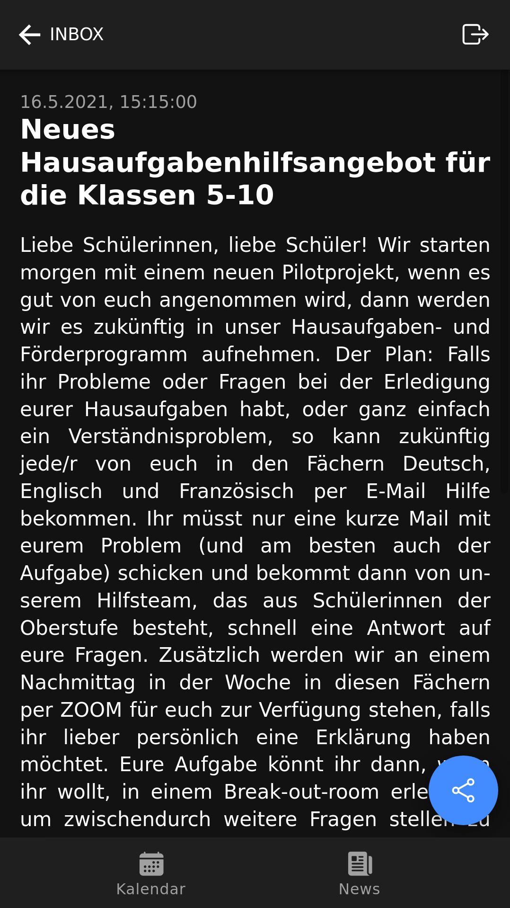
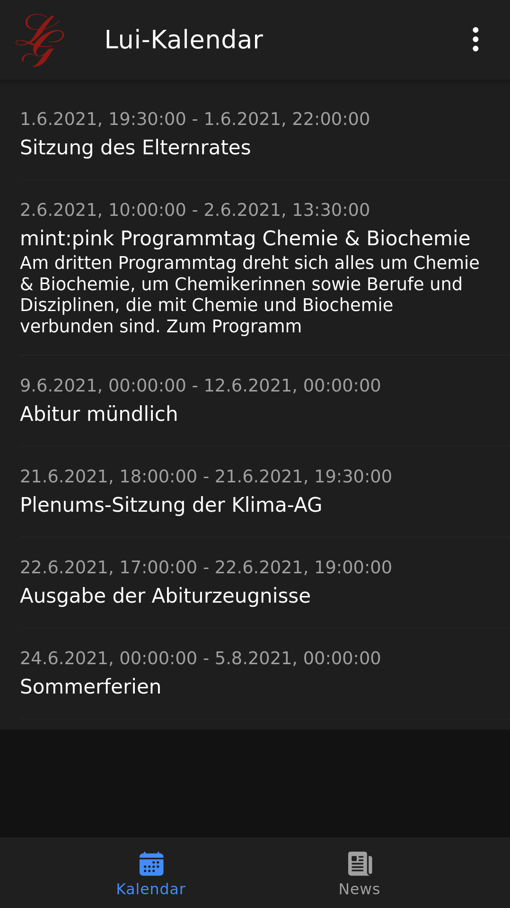

# Luise-News 📰

> A news (web) app for the Luisen-Gymnasium Bergedorf. 

This is just a little project to lern React.js, Ionic and android development. It is likely that this project won't be maintained for long. 

## Usage 🤚

You can switch between recent blog entries *(news)* and upcoming events *(calendar)* in the toolbar at the bottom. Each entry will be shown in a list, containing the title, the publication date und a short description if available. 

When an entry seeks interest, you can click on it for further information. The full article will be presented on a new page. On this page you can also share the article to other people or open the original article in a browser. 

## Gallery 🖼

<table>
<tr>
<td></td>
<td></td>
<td></td>
</tr>
</table>


## Develop 🛠

```sh
# install dependencies
npm install
npm i -g ionic

# run web app with live preview
ionic serve

# build for android*
ionic capacitor sync
```
> \* ⚠ you need to have android-studio installed! 

## ⚒ Build with

Ionic Framework and Capacitor 

## Roadmap

- [x] RSS-Feed
- [x] browser preview
- [x] share button
- [x] iCal calendar
- [] add entry to local calendar
- [] (mail)

## Authors

- **Gero Beckmann** - *Initial work* - [Geronymos](https://github.com/Geronymos)